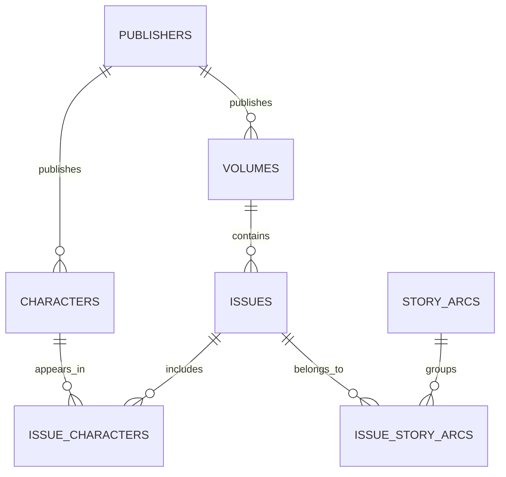

# Long Box

**Explainable comic reading paths for people who do not know where to start.**

Long Box turns a character query such as **Daredevil**, **Superman**, or **Batman + Wonder Woman** into a grounded reading path. ComicVine supplies reference data; Long Box searches live when a character is not in the local catalog, imports a small issue slice on demand, normalizes it in Postgres, and ranks useful entry points with deterministic, inspectable logic instead of inventing reading orders.

> **Live:** <https://long-box.vercel.app>
>
> Status: Phases 1–4 are complete. The [data foundation](docs/PHASE_1_VALIDATION.md), [deterministic reading-path engine](docs/PHASE_2_VALIDATION.md), [editorial product UI](docs/PHASE_3_VALIDATION.md), and [production deployment](docs/PHASE_4_VALIDATION.md) are validated against fixtures, live Supabase data, CI, and production smoke tests.

## Why this project exists

Comic data is not a simple list of books. Characters cross titles, issue numbers restart across reboots, and story arcs span many-to-many relationships. Long Box treats that mess as a data and retrieval problem:

- search local data first, then ComicVine for characters not loaded yet;
- ingest typed ComicVine responses without exposing the API key;
- normalize publishers, characters, volumes, issues, and story arcs locally;
- preserve issue-to-character and issue-to-arc relationships;
- answer set-intersection queries for multiple characters in SQL;
- build explainable recommendations on top of verified facts.

## Architecture


The current code keeps boundaries small:

```text
src/lib/comicvine/   raw schemas, defensive parsing, normalized domain types
src/lib/ingestion/   explicit ingestion orchestration and idempotent upserts
src/lib/db/          server-side Supabase client and reusable queries
supabase/migrations/ schema, indexes, RLS, and SQL retrieval functions
supabase/tests/      deterministic database integration assertions
scripts/             development seed and isolated Postgres test runner
```

## Phase 1 engineering highlights

- **Runtime validation:** Zod rejects malformed ComicVine payloads before persistence.
- **Resilient API client:** pagination, timeouts, bounded retries, rate-limit responses, HTTP errors, and ComicVine application errors are handled explicitly.
- **Separate data models:** raw ComicVine shapes do not leak into normalized application types.
- **Idempotent persistence:** ComicVine IDs are unique per entity, join tables use composite primary keys, and ingestion uses conflict-aware upserts.
- **SQL set intersection:** `issues_for_characters(text[])` returns only issues containing every requested character and includes the associated volume.
- **Server-only secrets:** no credential uses a `NEXT_PUBLIC_` prefix; database tables have RLS enabled with no browser write policy.
- **Deterministic validation:** unit fixtures require no network, and database assertions run in an ephemeral local Postgres cluster.

## Data model



All entities use internal UUID primary keys and unique ComicVine IDs. Lookup indexes cover case-insensitive character names, volume issues, reverse character joins, and reverse story-arc joins.

## Run locally

### Prerequisites

- Node.js 22+
- npm
- a [ComicVine API key](https://comicvine.gamespot.com/api/)
- a Supabase project
- PostgreSQL command-line tools for `npm run test:db`

### 1. Install

```bash
git clone https://github.com/varun-gangadharan/long-box.git
cd long-box
npm install
cp .env.example .env.local
```

Set these server-only values in `.env.local`:

```dotenv
COMICVINE_API_KEY=...
SUPABASE_URL=https://your-project.supabase.co
SUPABASE_SERVICE_ROLE_KEY=...
```

Never commit `.env.local` or expose the service-role key to browser code.

### 2. Apply the schema

With the Supabase CLI linked to your project:

```bash
npx supabase link --project-ref YOUR_PROJECT_REF
npx supabase db push
```

The migration is also readable at [`supabase/migrations/202608170001_phase_1_foundation.sql`](supabase/migrations/202608170001_phase_1_foundation.sql).

### 3. Seed development data

```bash
npm run seed
```

This ingests up to 100 issues each for Daredevil and Spider-Man, then reports:

- Daredevil issue count;
- Spider-Man issue count;
- issues containing both characters;
- story arcs attached to Daredevil issues;
- one shared issue with its volume.

Pass a smaller per-character issue limit while developing:

```bash
npm run seed -- 25
```

Running the command again updates existing records and relationships instead of duplicating them.

### 4. Validate

```bash
npm test
npm run eval
npm run test:db
npm run typecheck
npm run lint
npm run build
```

`npm run eval` is the recommendation-quality gate. See [How recommendations are
ranked](#how-recommendations-are-ranked) below.

`npm run test:db` starts an isolated temporary Postgres instance, applies the migration, checks idempotent issue upserts, single-character retrieval, two-character intersection, story-arc retrieval, and volume joins, then removes the instance.

## How recommendations are ranked

Presence is not the same as co-starring. Two characters being credited in the same
issue says almost nothing; what a reader wants to know is whether a book is *about*
them together, and whether they can start there. The engine scores those two
questions separately and reports both.

**Togetherness** — is this book actually about these characters?

The dominant signal is `co_issue_count / volume_issue_count`, taken from ComicVine's
per-volume character appearance counts. A forty-issue team book the pair headline
scores near 1; a seven-hundred-issue title one of them guest-starred in once scores
near 0. Sustained consecutive appearances, how densely the shared issues sit inside
the run, shared story arcs, and the volume title carry the rest.

**Beginner friendliness** — can somebody who has read nothing start here?

Entry point (does it begin at a `#1`), how deep into a volume it starts, whether the
story is self-contained rather than an event tie-in, cast size, whether one writer
holds the run together, and a commitment curve that peaks at a short run — a single
issue cannot show a relationship, and a hundred issues is not a starting point.

**Recency is a nudge, not a verdict.** Newer art, lettering and pacing are easier to
read cold, so `modernityScore` gives a recent book a small edge. It lives here rather
than in togetherness because newer books are easier to start with, not better — most
of the medium's landmarks are old, and plenty of modern books are poor. Across six
decades it moves a final score by under `0.05`: enough to settle a close call between
two comparable books, nowhere near enough to push a run that genuinely represents the
characters below a recent one that does not. The `modern-vs-classic` eval case states
the rule directly, and a ranking invariant pins the size of the swing.

**The gate.** A candidate whose togetherness falls below `TOGETHERNESS_GATE` is never
offered as a starting point, however approachable it looks. It is still listed, under
"passing appearances", with a warning. Telling someone their characters have no shared
story is more useful than dressing up a cameo.

Retrieval matters as much as ranking. Each character's complete ComicVine appearance
list is cached in `character_issue_credits`, so the shared set is a real intersection
rather than an overlap between two arbitrary samples. Metadata for those issues is
hydrated a hundred per request, and the expensive per-issue detail calls — capped at
roughly 200 per hour by ComicVine — are spent only on the issues that might be
recommended.

### Evaluating the engine

| Check | Command | Runs in CI |
| --- | --- | --- |
| Golden cases against frozen fixtures | `npm run eval` | yes |
| Ranking invariants | `npm test` | yes |
| Capture real retrieval into fixtures | `npm run eval:record` | no |
| Whole pipeline against live ComicVine | `npm run eval:live -- "Nightwing+Starfire"` | no |
| Qualitative second opinion | `npm run eval:judge` | no |

Cases live in `evals/cases/` and name both what a good answer looks like and the
specific wrong answer we have seen. Fixtures marked `authored` encode known facts
about well-documented comics so the gate works without credentials; `recorded` ones
are real RPC output and also exercise retrieval. The scorecard reports precision@1,
recall@3, and the rate at which known bad answers are recommended.

`eval:judge` asks a model to grade saved output. It is advisory, never gates CI, and
never feeds ranking — the design principle below still holds.

## Current limitations

- A live seed requires user-provided ComicVine and Supabase credentials; CI and unit tests never require paid or secret-backed network access.
- ComicVine metadata can be incomplete. Nullable source fields are preserved, but a failed required detail request stops the run rather than overwriting known metadata with fallback nulls.
- Relationship replacement is atomic, but the full multi-entity ingestion run spans several database requests; whole-run recovery hardening belongs in Phase 4.
- Ranking and UI work have not started. Phase 2 will consume these validated SQL queries rather than bypassing them.

## Roadmap

See the [implementation plan and Phase 3 design context](docs/IMPLEMENTATION_PLAN.md) for phase gates, the signature branching-path UX, provisional visual tokens, responsive behavior, and the Figma handoff checklist.

1. **Foundation:** normalized schema, ComicVine client, ingestion, validation queries.
2. **Reading-path engine:** deterministic candidate grouping, ranking, reasons, and API.
3. **Product UI:** accessible multi-character search and recommendation details.
4. **Production hardening:** measured query plans, caching where justified, CI, logging, and failure tests.
5. **Optional intent parser:** an LLM may parse preferences, but factual recommendations remain database-backed.

## Design principle

> The model may interpret intent. Long Box determines facts.

No LLM is required for the core product, and no LLM will be allowed to invent issue numbers, publication metadata, or reading order.
